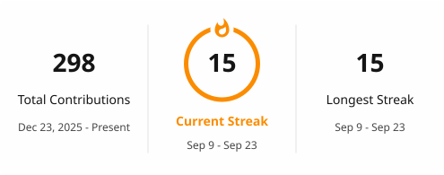

# 𝓧𝓲𝓪𝓸𝓒𝓱𝓮𝓷

### 𝓑𝓾𝓲𝓵𝓭𝓲𝓷𝓰 𝓐𝓘 𝓪𝓰𝓮𝓷𝓽𝓼, 𝓸𝓷𝓮 𝓟𝓡 𝓪𝓽 𝓪 𝓽𝓲𝓶𝓮.

##

🎯 **AI Agent / LLM 应用开发 · 2029 届研究生**

✉️ [1326713348@qq.com](mailto:1326713348@qq.com)

  <picture>
    <source media="(prefers-color-scheme: dark)" srcset="./profile/streak-dark.svg" />
    <source media="(prefers-color-scheme: light)" srcset="./profile/streak-light.svg" />
    
  </picture>

## Open Source Contributions

<!-- OSS_CONTRIBUTIONS:START -->

<!-- 仅列「改动了源码」的已合并 PR，每个仓库取一条最有代表性的；纯文档 / 纯数据改动（README、docs/、*.json、*.yaml…）不计入表内。例外见 _gen/build.py 的 STAR_ENDORSE：极少数 star 背书价值高的仓库即使只有文档类合并也保留一行。(+N) 表示该仓库另有 N 个已合并 PR（含文档类）。 -->

  
  
  
  

| Status | Project | PR | Scope |
| --- | --- | --- | --- |
| Merged | `harry0703/MoneyPrinterTurbo` (125.6k stars) | [#1351](https://github.com/harry0703/MoneyPrinterTurbo/pull/1351) (+35) | Log concat progress while ffmpeg is running |
| Merged | `CherryHQ/cherry-studio` (52.1k stars) | [#20418](https://github.com/CherryHQ/cherry-studio/pull/20418) (+8) | Fix dead heading anchors in the reference docs |
| Merged | `zhayujie/CowAgent` (47.1k stars) | [#3133](https://github.com/zhayujie/CowAgent/pull/3133) (+35) | Ignore empty b64_json/url when saving generated images |
| Merged | `volcengine/OpenViking` (38.6k stars) | [#4213](https://github.com/volcengine/OpenViking/pull/4213) | Render fields without init_value as empty on init |
| Merged | `HKUDS/Vibe-Trading` (34.0k stars) | [#1178](https://github.com/HKUDS/Vibe-Trading/pull/1178) | Point official read-only MCP seed at /mcp-public endpoint |
| Merged | `kirodotdev/KiroCrew` (4.1k stars) | [#4472](https://github.com/kirodotdev/KiroCrew/pull/4472) | Refuse unknown-slot approval-mode requests before any global mutation |
| Merged | `rlaope/oh-my-hermes` (2.9k stars) | [#1044](https://github.com/rlaope/oh-my-hermes/pull/1044) | Refresh stale lintlang snapshot entry |
| Merged | `TencentCloud/Octop` (4.9k stars) | [#348](https://github.com/TencentCloud/Octop/pull/348) | Force utf-8 stdio so octop init does not crash on GBK consoles |
| Merged | `xuzhougeng/wisp-science` (1.2k stars) | [#932](https://github.com/xuzhougeng/wisp-science/pull/932) | Support MCP Apps App→Server tool calls (serverTools / tools/call, #773) |

99 merged · 22 in review · 11 closed — 29 repositories, 132 PRs · updated 2026-09-25

<!-- OSS_CONTRIBUTIONS:END -->

## Featured Project

|  |  |
| --- | --- |
| **[LingXiAgent](https://github.com/c020627/LingXiAgent)** | 基于 Multi-Agent 架构的智能对话与任务执行平台 |
| Stack |      |
| Highlights | RAG 知识库 · 三层记忆系统 · MCP 工具生态 · 技能编排 · 可视化界面 |

<picture>
  <source media="(prefers-color-scheme: dark)" srcset="https://raw.githubusercontent.com/c020627/c020627/output/github-contribution-grid-snake-dark.svg">
  <source media="(prefers-color-scheme: light)" srcset="https://raw.githubusercontent.com/c020627/c020627/output/github-contribution-grid-snake.svg">
  
</picture>

  <picture>
    <source media="(prefers-color-scheme: dark)" srcset="https://github-readme-activity-graph.vercel.app/graph?username=c020627&theme=xcode&bg_color=FF000000&hide_border=true" />
    <source media="(prefers-color-scheme: light)" srcset="https://github-readme-activity-graph.vercel.app/graph?username=c020627&theme=xcode&bg_color=FF000000&color=000000&hide_border=true" />
    
  </picture>

